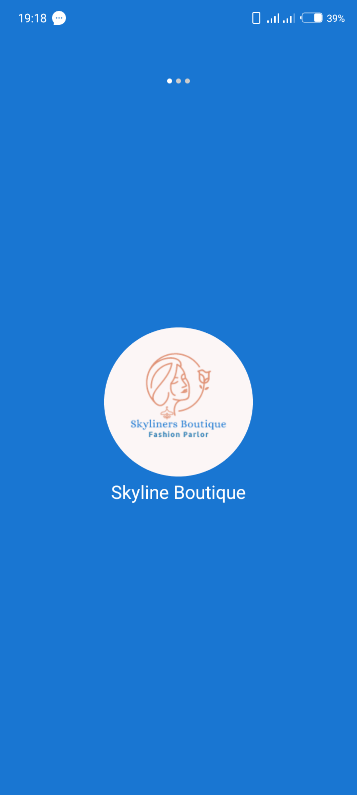
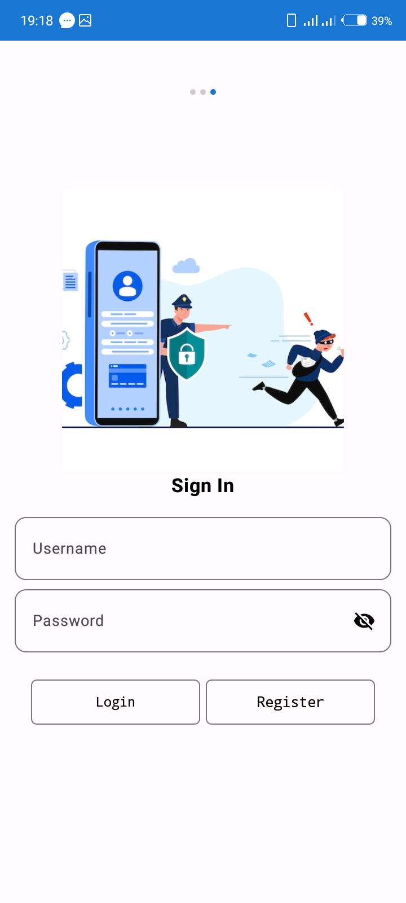
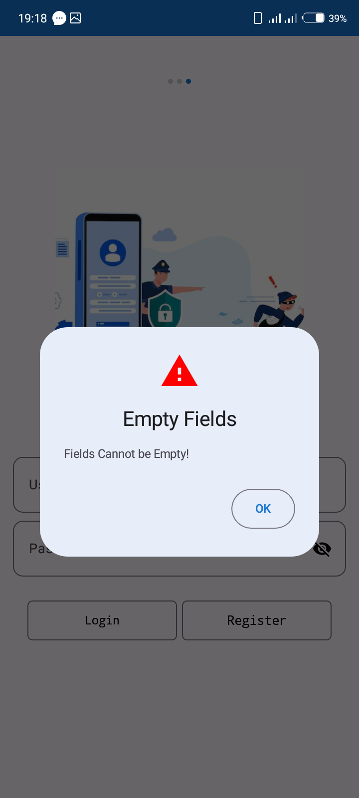
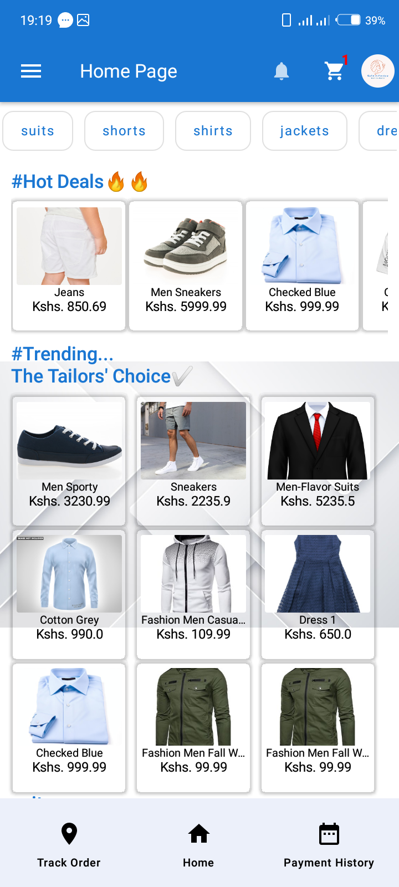

# Skyline Boutique

*Skyline Boutique*

# Description

The Skyline Boutique Application is an Android Application built in Kotlin to allow the user to view and purchase items from the Skyline Boutique. The user can view the items in the boutique, add items to their cart, and purchase items from the cart. The user can also view their order history and view the details of each order.

# Screenshots

<!-- Add image sizes for better formatting -->

*User Login*

*Login Failure*

*Login Successful*

*Home Screen*
